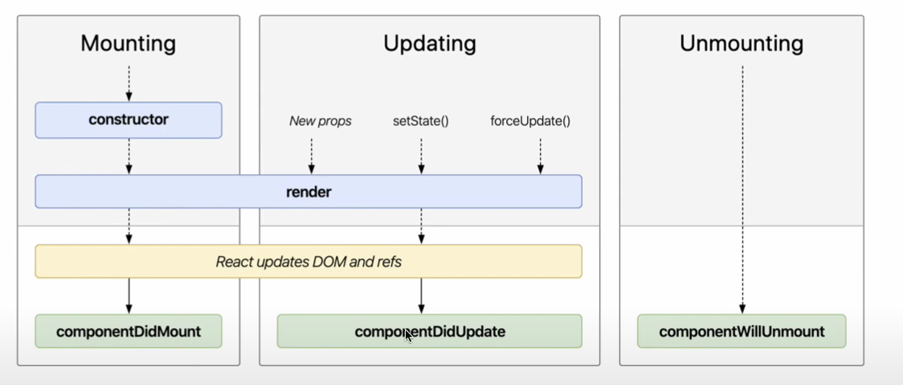
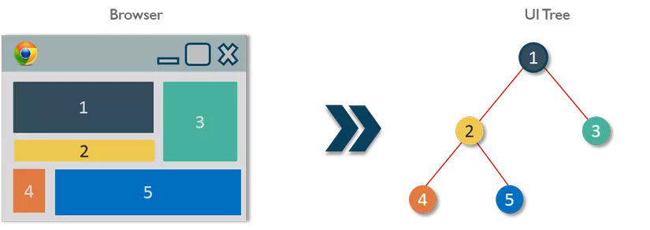
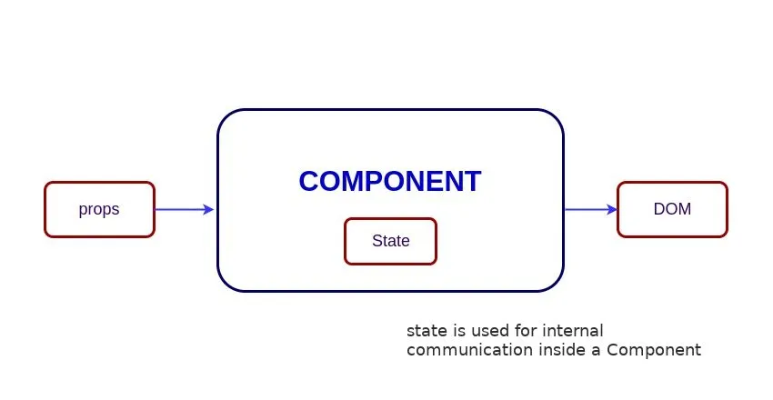
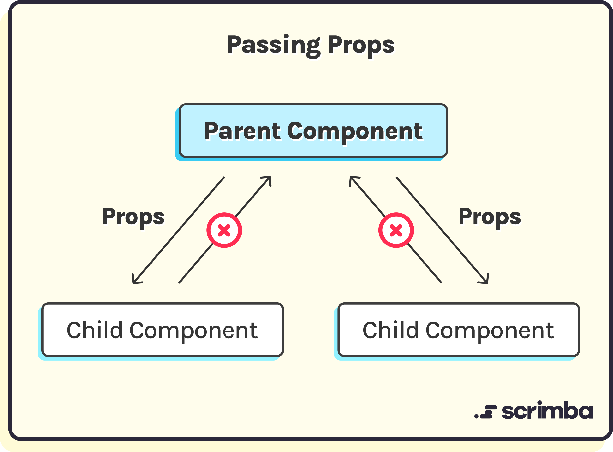
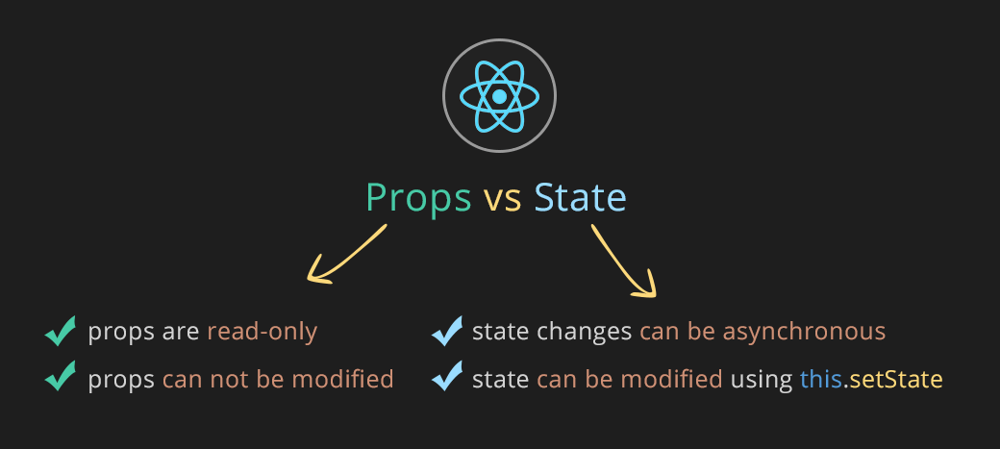

# ⚛️ Series Học ReactJS Từ A đến Z

- **Author: `@Vinhdev04`**


> Học ReactJS bài bản, dễ hiểu và thực chiến – dành cho người mới bắt đầu đến khi làm được dự án thật! 🚀

---

## 📚 Giới thiệu Series


Chào mừng bạn đến với **series học ReactJS**! Đây là chuỗi bài học được xây dựng nhằm giúp bạn:

- Hiểu rõ về **React là gì**, tại sao nên dùng React
- Làm quen với các khái niệm như **JSX**, **Component**, **Props**, **State**, **Hooks**
- Tạo ứng dụng **Single Page Application (SPA)**
- Làm việc với **React Router**, **Axios**, **State Management**
- Xây dựng dự án thực tế với React

> 👨‍💻 Không chỉ học lý thuyết, bạn sẽ được **code thực tế** và làm **dự án nhỏ cuối khóa** để ôn lại kiến thức.

---

## 🧱 Cấu trúc nội dung

| STT | Chủ đề             | Nội dung chính                                |
| --- | ------------------ | --------------------------------------------- |
| 1️⃣  | Giới thiệu ReactJS | JSX, Virtual DOM, tạo project React           |
| 2️⃣  | Component & Props  | Tạo component, truyền dữ liệu qua props       |
| 3️⃣  | State & Event      | Quản lý state, xử lý sự kiện trong React      |
| 4️⃣  | Hooks cơ bản       | `useState`, `useEffect`, custom hooks         |
| 5️⃣  | React Router       | Routing, Nested Route, Navigation             |
| 6️⃣  | Gọi API với Axios  | Fetch dữ liệu từ backend, xử lý loading/error |
| 7️⃣  | State nâng cao     | Context API, Redux (overview)                 |
| 8️⃣  | Dự án mini         | App quản lý Todo, Blog hoặc sản phẩm          |
| 9️⃣  | Deploy             | Build và deploy lên Vercel hoặc Netlify       |

---

## 🎯 Mục tiêu sau series này

- ✅ Hiểu vữa cấu trúc và nguyên lý hoạt động của React
- ✅ Tự tin xây dựng SPA với React Router
- ✅ Biết gọi API, xử lý dữ liệu
- ✅ Biết deploy project lên nền tảng hosting
- ✅ Là nền tảng để học nâng cao: `Next.js`, `Redux Toolkit`, `Tailwind`, v.v.

---

## 📌 Yêu cầu kiến thức nền

- HTML / CSS / JavaScript (ES6+)
- Biết về function, array, object trong JS
- Kiến thức về DOM và event handling
- Git, VSCode là một lợi thế

---

## 💡 Mẹo học hiệu quả

- 📓 Tự ghi chúc lại những gì đã học
- 🔁 Ôn lại bài sau 2–3 ngày
- 🧪 Thử làm lại các bài bằng cách viết lại theo cách của bạn
- 📚 Đọc tài liệu chính thức: https://reactjs.org

---

## 🛠 Công cụ hỗ trợ

- Node.js v18+
- Code Editor: VSCode
- Extensions: React Developer Tools, Prettier
- Axios, React Router
- Hosting: Vercel / Netlify

---

## 🧲 Dự án cuối khóa - ReactJS

### 📌 Tên dự án: `Website Tuyển Dụng`

### 🎨 Stack sử dụng: ReactJS + React Router + Axios + (tuỳ chọn Tailwind hoặc Bootstrap)

### 📂 Cấu trúc thư mục :

```
src/
│
├── components/
├── pages/
├── services/
├── assets/
├── App.jsx
└── main.jsx
```

### ⚙️ Các chức năng chính:

- [ ] Xem danh sách ...
- [ ] Tìm kiếm ...
- [ ] CRUD dữ liệu ...

---

## ❤️ Cảm ơn bạn đã theo dõi!

> Nếu thấy series hữu ích, hãy ⭐ repo này và chia sẻ cho bạn bè nhé!

---

### 🌐 Khởi tạo project React

- Dùng `Vite` (khuyến nghị)

  ```bash
  npm create vite@latest my-app --template react
  cd my-app
  npm install
  npm run dev
  ```

- Dùng `Create React App` (truyền thống)
  ```bash
  npx create-react-ap
  ```

---

### ♻️ **Ôn tập Javascript ES6**

#### `1. Module`:

- Là 1 file chứa mã Javascript mà bạn có thể tái sử dụng ở file khác
- Giúp chia nhỏ ứng dụng, dễ quản lý và bảo trì
- Khi sử dụng thêm `type=module` vào file javascript
  > Ví dụ: `<script type="module" src="script.js"></script>`
- `Named Export`: cho phép export nhiều phần tử từ một file
  - Khi import cần sử dụng `{}`
  - > Ví dụ: `import { showName } from "./main.js"; `
- `Default Export`: cho phép mỗi `module` chỉ có 1 `default export`
  - Khi import không cần `{}`
  - > Ví du: `import grade from "./main.js";`
- `Import default`:
  - Tên biến import đặt tùy ý
- `Import named`:
  - Đặt tên với `as`
  - > Ví dụ: `import{myName as newName } from ""  `
- `import * name from ""`: lấy tất cả
- `Lưu ý: `
  - một module chỉ có 1 export default
  - `import *` sẻ không bao gồm export default

---

#### `2. Function`:

- `Declaration Function`:
  - Syntax:
    - > function function_name(parameters){}
- `Expression Function`:
  - Syntax:
    - > const name = function(parameters){}
- `Arrow Function`:
  - Syntax:
    - > const name = (parameters) => {}

---

#### `3. Object and Classes`:

- `Object`:
  - được sử dụng đê nhóm các giá trị lại với nhau
  - `key-value`
- `Class`:
  - khắc phục nhược điểm của object
  - sử dụng hàm tạo `constructor()` để khởi tạo thuộc tính cho đối tượng

---

#### `4. Array`:

- `Array`
  - là một dạng đặc biệt của object
  - được thiết kế để lưu trữ theo thứ tự và truy cập bằng chỉ sô (index)
  - index bắt đâu: 0, kết thúc: n-1
  - `Type of Array`: là 1 `Object` , vậy nên mới khởi tạo 1 mảng được bằng `constructor`
- `Method`:

  - ### `push()`:
    - thêm phần tử vào cuối mảng
  - ### `pop()`:
    - xóa phần tử cuối mảng
    - CÓ làm thay đổi mảng ban đầu
    - trả về phần tử đã bị xoá ra khỏi mảng
    - trả về undefined nếu mảng rỗng
  - ### `shift()`:
    - xóa phần tử đầu mảng
    - CÓ làm thay đổi mảng ban đầu
    - trả về phần tử đã bị xoá ra khỏi mảng
    - trả về undefined nếu mảng rỗng
  - ### `unshift`():
    - thêm phần tử vào đầu mảng
  - ### `map()`:
    - duyệt phân tử mảng và `tạo ra mảng mới từ mảng cũ`, `biến mảng thành Object[key-value]`
    - iúp tạo ra một mảng mới với các phần tử là kết quả từ việc thực thi một hàm lên TỪNG PHẦN TỬ của mảng ban đầu
    - KHÔNG làm thay đổi mảng ban đầu
  - ### `findIndex()`:

    - Tìm phần tử đầu tiên thỏa mãn trong mảng [true-false]

    ```bash
        const fruits = ["Cam", "Xoài", "Dứa", "Kiwi"];
        const res = fruits.findIndex((item) => {
            return item === "Dứa";
        });
        console.log(res); // 2 -> `có và nằm ở vị trí index = 2`
    ```

  - ### `reducer()`:
    - dùng để thực thi một hàm lên từng phần tử của mảng (từ trái sang phải) với một biến tích lũy để thu về một giá trị duy nhất
    - KHÔNG làm thay đổi mảng ban đầu
    - trả về giá trị sau khi rút gọn
  - ### `some()`:
    - xác định xem ít nhất một thành viên mảng có thỏa mãn bài kiểm tra được xác định bởi hàm đã cho hay không.
    - Nó trả về true nếu nó tìm thấy một phần tử trong mảng mà hàm đã chỉ định trả về true; ngược lại, nó trả về false.
    - Nó không làm thay đổi mảng.
  - ### `every()`:
    - xác định xem tất cả thành viên mảng có thỏa mãn bài kiểm tra được xác định bởi hàm đã cho hay không.
  - ### `filter()`:
    - KHÔNG làm thay đổi mảng ban đầu
    - trả về 1 mảng mới sau khi lọc
    - trả về một mảng RỖNG nếu không có phần tử nào thỏa mãn điều kiện
  - ### `includes()`:
    - kiểm tra xem phần tử đã cho có tồn tại trong mảng hay không
    - KHÔNG làm thay đổi mảng ban đầu
    - trả về kiểu Boolean: true nếu tìm thấy hoặc false nếu không tìm thấy
  - ### `forEach()`:
    - dùng để duyệt qua từng phần tử của mảng
  - `find()`:
    - dùng để lọc phần tử trong mảng, tuy nhiên nó sẽ trả về giá trị ĐẦU TIÊN tìm thấy ở trong mảng hoặc có thể trả về undefined nếu không tìm thấy
    - TIÊN tìm thấy ở trong mảng hoặc có thể trả về undefined nếu không tìm thấy
  - ### `concat()`:
    - Phương thức tạo ra một mảng mới bằng cách hợp nhất (kết hợp) các mảng hiện có
    - Phương thức không thay đổi các mảng hiện có
  - ### `indexOf()`:
    - dùng để tìm kiếm vị trí của phần tử trong mảng
    - trả về giá trị index ĐẦU TIÊN của mảng nếu phần tử tồn tại trong mảng
    - trả về -1 nếu phần tử không tồn tại trong mảng
    - KHÔNG làm thay đổi mảng ban đầu
  - ### `join()`:

    - chuyển đổi một mảng thành một chuỗi các giá trị mảng và có thể chỉ định phân tách bằng (,."",...)

  - ### `slice()`:

    - Phương thức không loại bỏ bất kỳ phần tử nào khỏi mảng
    - Tạo ra một mảng mới

  - ### `splice(start,deleteCount)`:

    - Thêm 1 giá trị mới vào mảng
    - Lấy ra giá trị của 1 mảng
    - Xóa phần tử khỏi mảng và trả về mảng bị xóa
    - Tạo ra một mảng mới

  - ### `toSpliced()`:

    - Tương tự splice(), nhưng giữ cho mảng gốc không thay đổi

  - ### `toString()`:

    - chuyển đổi một mảng thành một chuỗi các giá trị mảng

  - ### `at()`:

    - trả về phần tử tại vị trí index

  - ### `copyWithin()`:

    - Phương thức sao chép các thành phần mảng đến một vị trí khác trong một mảng
    - Phương thức ghi đè lên các giá trị hiện có.
    - Phương thức không thêm các giá trị vào mảng
    - Phương pháp không thay đổi độ dài của mảng.

  - ### `flat()`:

    - Phương thức tạo ra một mảng mới với các phần tử con được nối với độ sâu được chỉ định.

  - ### `flatMap()`:
    - Phương thức đầu tiên ánh xạ tất cả các phần tử của một mảng và sau đó tạo một mảng mới bằng cách làm phẳng mảng.

---

#### `5. Destructuring [Array,Object,Function]`:

- là một tính năng quan trọng
- Cho phép trích xuât dữ liệu từ `array` hoặc `object` một cách nhanh và dễ dàng
- Với `array` trích xuất thông qua `vị trí (index)`
- Với `object` trích xuất thông qua `property name` `tên biến phải trùng với ten thuộc tính trong Oject`
- Sử dụng trực tiếp trong tham số (parameter) của hàm. Để tránh việc lặp lại truy cập thuộc tính bên trong thân hàm
- ` Destructuring` với rest parameter với `Array`
- ` Destructuring` thiết lập giá trị mặc định với `Array`
- ` Destructuring` bỏ qua phần tử ko cần thiết với `Array`
- ` Destructuring` đổi tên biến với `Object`
- ` Destructuring` với rest parameter với `Object`
- ` Destructuring` thiết lập giá trị mặc định với `Object`

#### `6. Spread Operator (...)`:

- Rải các phần tử của một mảng ra thành các phần tử riêng lẻ
- Rải các cặp key-value trong 1 object để kết hợp hoặc sao chép
- Thường sử dụng để gộp dữ liệu
- Thường sử dụng để sao chép mang hoặc object
- Thêm mới dữ liệu một cách linh hoạt
- Đối với object nếu có cùng key thì key sau sẻ ghi đè key trước

  ```bash

    let user = {
      id: 1,
      name: "An",
      email: "pcv.fed@gmail.com",
      role: "user",
    };

    const update = {
      address: "HCM",
      favorite: "Coding",
      role: "admin",
    };

    console.log(user);
    // { id: 1, name: 'An', email: 'pcv.fed@gmail.com' ,role: 'user'}
    user = { ...user, ...update };
    console.log(user);
    // { id: 1, name: 'An', email: 'pcv.fed@gmail.com', address: 'HCM', favorite: 'Coding' ,role: 'admin'}

  ```

---

## 💠🌐 `REACTJS`

### Cách sử dụng `JSX` trong React:

- `JSX` là `Javascript Syntax Extension`, cú pháp mở rộng của Javascript
- File `.jsx` trình duyệt ko hiểu đuợc mà cần công cụ biên dịch sang Javascript (Vite,...)
- Để chạy được cần cài đặt `node js`
- Trong `React` chỉ đuợc `return về 1 phần tử duy nhất` nên cần sử dụng `Fragment`: <></> để bọc các khối code
  - Lý do sử dụng Fragment:
    - Không thêm thẻ dư thừa vào DOM
    - Giữ cho clean code

---

### Tìm hiểu khái niệm vòng đời(`Lifecycle`) của `Class Component` trong React:


- `Data` có thể thay đổi theo thời gian
- <b> `Init -> Mounting -> Updation -> Unmounting` </b>

  - Giai đoạn `Mounting`: Sinh ra component
    - `componentWillMount()`:
      - Được gọi trước khi `render()`
      - Dùng để đăng ký các sự kiện toàn cục
      - Dựa vào `props` để tính toán và set lại `state`
    - `render()`:
      - Bắt buộc có trong component
      - `Trả về 1 Object JSX`(Có thể lồng các object với nhau, nhưng phải có 1 object gói tất cả các object lại) để hiển thị hoặc null/false nếu ko muốn hiển thị gi.
      - `Không được gọi setState() trong hàm này`(cũng như trong các hàm này mà gọi đên), `bởi khi gọi setState() -> render() chạy -> lặp vô hạn`
    - `componentDidMount()`:
      - `Được gọi ngay sau khi `render()` được gọi đến lần đầu tiên chạy xong thì sẻ chạy.`
      - Thường `dùng đê fetch dữ liệu từ server và sau đó setState() đê render ra dữ liệu`
      - Sau đó các phần tử đuợc sinh ra và `có thể thao tác với DOM băng javascript trong hàm này`
  - Giai đoạn `Updating`: Cập nhật component
    - `componentWillReceiveProps(nextProps)`:
      - `Hàm được chạy khi mà props của component đa được sinh ra có sự thay đổi`.
      - Phải `gọi setState() nếu muốn render lại dữ liệu`
    - `shouldComponentUpdate(nextProps,nextState)`:
      - `Được gọi trước render`
      - Trả về true/false
      - Nếu `false` -> `không render lại`
      - Mặc định là true trong `Component`
      - Còn `PureComponent` nó sẻ cần so sánh trong `shouldComponentUpdate(nextProps,nextState)`
    - `componentWillUpdate(nextProps,nextState)`:
      - `Được gọi ngay sau shouldComponentUpdate()` nếu `shouldComponentUpdate() trả vê true`
      - `Không gọi setState()` trong hàm này bởi vì `hàm này đê chuân bị update chứ ko tạo ra 1 update mới` -> sẻ rơi vào lặp vô hạn
      - Hàm `render() được gọi ngay sau hàm này`.
    - `componentDidUpdate(prevProps,prevState)`:
      - `Được gọi ngay sau render() từ lần thứ 2 trở đi`
      - `Cần kiểm tra prevProps,prevState trước khi setState()`
  - ## Giai đoạn `Unmounting`: Loại bỏ component khỏi DOM

    - `Được gọi khi 1 component đuợc lọai bỏ khỏi DOM`
    - Thực hiện các tác vụ như dọn dẹp, hủy các timer,phần dư thừa,..

  - ## Ưu tiên sử dụng:
    

---

### Tìm hiểu vê `Components`:

#### Lý thuyết:



- <b>`Components`</b> là một `Object` sử dụng đê tạo các thành phân giao diện UI
- Nó giúp tách nhỏ từng phần của ứng dụng
- Dễ tái sử dụng và bảo trì

#### Các loại `Components`:

- `Function components`: Hay còn gọi là `Stateless Components`

  - Là các `components` đuợc viết dưới dạng `function`
  - Không có trạng thái (`state`)
  - Không có phương thức `lifecycle` riêng của nó
  - Ví dụ:

    ```bash
      import React from 'react';

      function MyComponent(props) {
        return (
          <div>
            <h1>Hello, {props.name}!</h1>
            <p>{props.message}</p>
          </div>
        );
      }
      export default MyComponent;
    ```

- `Class components`: Hay còn gọi là `Stateful Components`

  - Là các `components` đựơc viết dưới dạng `class`
  - Có trạng thái (`state`)
  - Có các phương thức (`lifecycle`) riêng của nó
  - Ví dụ:

    ```bash
       import React from 'react';

       class MyComponent extends React.Component {
         constructor(props) {
           super(props);
           this.state = { count: 0 };
       }

         handleClick = () => {
           this.setState(prevState => ({
             count: prevState.count + 1
           }));
         };

         render() {
           return (
             <div>
               <h1>Count: {this.state.count}</h1>
               <button onClick={this.handleClick}>Increment</button>
             </div>
           );
         }
       }
       export default MyComponent;
    ```

- `Presentational Components`:

  - Là các `component` chỉ có nhiệm vụ hiển thị dữ liệu
  - Không xử lý `logic - nghiệp vụ`
  - Chúng thường được gọi là `dumb components`
  - Ví dụ:

    ```bash

      import React from 'react';
      const Greeting = ({ name }) => {
        return (
          <div>
            <h1>Hello, {name}!</h1>
            <p>Welcome to my website.</p>
          </div>
        );
      };

      export default Greeting;
    ```

- `Container Components`:

  - Là các `components` sử dụng để `xử lý nghiệp vụ và logic`
  - Truy cập dữ liệu và truyền nó xuống các `Presentational Components` để hiển thi dữ liệu
  - Chúng thường được gọi là `smart components`
  - Ví dụ:

    ```bash
      import React from 'react';
      import { connect } from 'react-redux';
      import { fetchTodos } from '../actions';
      import TodoList from '../components/TodoList';

      class TodoListContainer extends React.Component {
        componentDidMount() {
          this.props.fetchTodos();
        }

        render() {
          const { todos, isLoading, error } = this.props;

          return <TodoList todos={todos} isLoading={isLoading} error={error} />;
        }
      }

      const mapStateToProps = state => ({
        todos: state.todos.data,
        isLoading: state.todos.isLoading,
        error: state.todos.error,
      });

      export default connect(mapStateToProps, { fetchTodos })(TodoListContainer);


    ```

---

### Tìm hiểu vê `State`:



- giữ thông tin về component
- Bất cứ khi nào dữ liệu thay đổi trong một component, State có thể được sử dụng.
- Giống như props, sate cũng giữ thông tin về component. Tuy nhiên, loại thông tin và cách xử lý nó khác nhau. State hoạt động khác với Props.
- `state` là thành phần của `component`
- `không nên cập nhật` state `bằng cách sử dụng trực tiếp this.state` mà `luôn sử dụng setState để cập nhật state` của các đối tượng.
- Sử dụng `setState để re-renders một component` và `tất cả các component con`.

---

### Tìm hiểu vê `Props`:



- Props thực chất là viết tắt của `Properties`
- giữ thông tin về component
- `props` lại được `truyền` giá trị từ `bên ngoài` vào `component`
- Nó không bao giờ được sửa đổi prop của chính nó.
- `props` có thể đến từ `parent`, hoặc có thể `được thiết lập bởi chính component đó`.
- Bạn `có thể thay đổi props` bằng cách sử dụng `setProps hay replaceProps` nhưng nó `không được khuyến khích`.
- Kể từ lúc chúng ta truyền props vào component thì chúng không được thay đổi. Điều này giúp bạn nghĩ đến sẽ sử dụng props cho bất kì component nào mà luôn hiển thị cùng 1 đầu ra cho cùng 1 đầu vào. Điều này giúp chúng ra dễ dàng kiểm soát nó.

---

### `children props`:

- Tự động chứa mọi thứ bên trong cặp thẻ mở và đóng của `component`
- `props.children` sẻ hiển thị nội dung mà bạn muốn đặt giữa cặp thẻ mở và đóng của `component`

---

### 🔍 So sánh `state` và `props`



- Trong ReactJS, `state` và `props` là hai khái niệm cốt lõi giúp quản lý và truyền dữ liệu trong các component.
- Dưới đây là bảng so sánh chi tiết giữa `state` và `props`.

| Tiêu chí              | **State**                                                         | **Props**                                                    |
| --------------------- | ----------------------------------------------------------------- | ------------------------------------------------------------ |
| **Định nghĩa**        | Là trạng thái nội bộ của một component                            | Là thuộc tính được truyền từ component cha vào component con |
| **Khả năng thay đổi** | Có thể thay đổi thông qua `setState` hoặc `useState`              | Không thể thay đổi trong component con                       |
| **Nơi khởi tạo**      | Được định nghĩa trong chính component                             | Được truyền từ bên ngoài (component cha)                     |
| **Quản lý bởi**       | Component hiện tại                                                | Component cha                                                |
| **Tái sử dụng**       | Thường không chia sẻ giữa các component                           | Dễ dàng tái sử dụng trong nhiều component khác               |
| **Mục đích sử dụng**  | Quản lý dữ liệu thay đổi theo thời gian hoặc tương tác người dùng | Truyền dữ liệu và hàm từ component cha                       |
| **Dùng trong**        | Class và Function component                                       | Class và Function component                                  |

---
